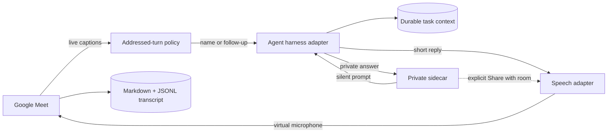

# Agent Meet Bridge


[](https://github.com/Bbasche/agent-meet-bridge/actions/workflows/ci.yml)
[](LICENSE)
[](package.json)
[](#requirements)

Bring a named, addressable coding agent into Google Meet. The agent joins as a participant, follows an agenda, answers when called by name, keeps a durable coding-task context, saves the call transcript, and gives the operator a private silent backchannel.

Agent Meet Bridge starts with the Codex stack, but its meeting, transcript, harness, speech, and sidecar boundaries are intentionally separable. Claude Code, Cursor, Hermes, and other agent harnesses can be added without rebuilding the Google Meet participant.

> **Early release:** this is a working macOS prototype, not a hosted meeting-bot service. Google Meet DOM changes can break automation. Use it with informed participant consent and supervise it during calls.

## What works today

| Capability | Current implementation |
| --- | --- |
| Meeting presence | Dedicated Playwright-controlled Chrome profile; headed or headless |
| Addressability | Passive wake-name policy with a short follow-up window |
| Input transcript | Google Meet live captions, mirrored into the local sidecar and Markdown/JSONL |
| Agent harness | A durable Codex app-server task using the operator's existing Codex login |
| Spoken replies | macOS AVFoundation TTS injected into a virtual Meet microphone |
| Private backchannel | Token-authenticated `127.0.0.1` sidebar; private by default |
| Call record | Timestamped room transcript plus a separate private audit trail |
| Camera safety | Physical camera acquisition is blocked; the Meet camera control is verified off |
| Code access | Read-only by default; writes require launch-time permission and a private `Prototype` turn |

There is no Recall.ai dependency and no per-minute meeting-bot bill. The Mac running the bridge must remain awake and online.

## How it works



The public/private boundary is enforced in the client, not only in the prompt. Private answers never reach meeting audio unless the operator explicitly opens **Share with room** and confirms **Speak in meeting**.

## Requirements

- macOS 14 or later
- Node.js 22 or later
- Google Chrome
- Xcode Command Line Tools (`swiftc`) for local speech output
- Codex CLI/Desktop authenticated with `codex login`
- A dedicated Google account for the meeting participant is strongly recommended

Apple Silicon is recommended. Linux and Windows speech adapters are roadmap items.

## Quick start

```bash
git clone https://github.com/Bbasche/agent-meet-bridge.git
cd agent-meet-bridge
npm ci
npm run setup:local
```

Sign the participant into an isolated Chrome profile once:

```bash
npm run assistant -- login --email bot@example.com
```

Complete Google sign-in in the opened browser. Do not point the bridge at your everyday Chrome profile.

Verify the machine before a call:

```bash
npm run doctor
```

Join a meeting:

```bash
npm run assistant -- start --headless \
  --meeting "https://meet.google.com/abc-defg-hij" \
  --name "YourAgent" \
  --instructions "You are our technical chief of staff." \
  --mode passive \
  --agenda ./agenda.example.md \
  --codex-workspace /path/to/repository
```

The host may need to admit the participant. The bridge announces that it is an AI participant and is saving a transcript. The private sidebar opens locally after admission. Press `Ctrl+C` to leave cleanly.

After observing at least one other participant, the agent leaves automatically if it remains alone for five continuous minutes. It then asks the durable task for a private debrief and saves `debrief.md` beside the transcript. Set `--alone-timeout-minutes 0` to disable this behavior.

Omit `--headless` while debugging Meet automation. Headless mode is recommended for longer calls because it avoids rendering an unnecessary meeting window.

## Durable Codex tasks

The bridge is BYO-agent: `--name` sets the wake name and participant identity, while `--instructions` (or `MEETING_AGENT_INSTRUCTIONS`) supplies optional persona and role guidance. Pass `--codex-thread` to bring an existing task, or omit it to create a dedicated task such as `YourAgent · meeting 2026-08-21`. The same task owns voice-triggered and private-sidecar turns and remains available after the meeting.

To keep the same agent across rejoins, set the task once in the ignored `.env` file:

```dotenv
MEETING_AGENT_CODEX_THREAD_ID=your-task-id
```

The bridge intentionally ignores the ambient `CODEX_THREAD_ID`, because that task is normally already held by the process that launched the bridge. Codex permits one active writer per persistent task.

## Private sidebar

The local sidebar combines two streams chronologically:

- **Call** — what Meet captions heard, including the agent's spoken replies.
- **Private** — the operator's silent prompts and the agent's private answers.

`⌘+Enter` sends privately. Private answers can be copied, used to prepare the operator's response, or deliberately shared with the room after an editable confirmation step. The server binds only to `127.0.0.1` and requires a random per-call token.

Preview the UI without joining a call:

```bash
npm run sidecar
```

## Configuration

Copy `.env.example` to `.env`. CLI flags take precedence.

| Variable | Purpose | Default |
| --- | --- | --- |
| `MEETING_AGENT_NAME` | Addressable participant name | `Agent` |
| `MEETING_AGENT_INSTRUCTIONS` | Optional persona or role guidance | none |
| `MEETING_AGENT_MODE` | `passive`, `active`, or `unrestricted` | `passive` |
| `MEETING_AGENT_TRANSCRIPT_SOURCE` | Input transcript adapter | `meet-captions` |
| `MEETING_AGENT_ALONE_TIMEOUT_MINUTES` | Alone time before automatic leave + debrief; `0` disables | `5` |
| `MEETING_AGENT_CODEX_THREAD_ID` | Reuse one durable task across rejoins | create a task |
| `MEETING_AGENT_AGENDA` | Agenda Markdown file | none |
| `MEETING_AGENT_PROFILE_DIR` | Dedicated Chrome profile | `data/browser-profile` |
| `CODEX_WORKSPACE` | Repository the agent may inspect | current directory |
| `MEETING_AGENT_VOICE` | AVFoundation voice/locale | `en-GB` |

Run `npm run assistant -- --help` for all flags.

## Why captions today

The current release treats Google Meet captions as the authoritative incoming transcript. It is much more stable than routing Meet's internal remote tracks through a page-level Web Audio graph, works in headless Chrome, and avoids a virtual audio-device setup. The tradeoffs are explicit:

- Meet controls recognition quality and caption availability.
- Human speech is currently labeled `Meeting`; speaker diarization is not implemented.
- Caption DOM and accessible labels are private implementation details and may change.
- Captions must remain enabled in the participant session.

The agent's return path is real audio: AVFoundation renders the answer locally and the bridge injects PCM into a synthetic Meet microphone.

## Audio roadmap

The long-term transcript adapter should not depend on Meet's UI. Planned experiments include:

1. Read decoded remote audio with `MediaStreamTrackProcessor` or a native WebRTC audio sink.
2. Mix participant tracks without page-level `captureStream()` polling.
3. Add energy/semantic VAD, interruption handling, and local Whisper.cpp transcription.
4. Add speaker diarization or Meet-speaker metadata when a stable source exists.
5. Support cross-platform TTS and virtual audio devices.
6. Graduate to a hosted Chromium worker for agents that should join without an awake Mac.

Optional Whisper development assets can be installed with:

```bash
brew install whisper-cpp ffmpeg
npm run setup:local -- --with-whisper
```

The optional `codex` realtime and `grok` voice runtimes remain experimental adapters. Grok requires `XAI_API_KEY`; Codex realtime availability depends on the installed app-server schema and account entitlement.

## Extending beyond Codex

The current harness adapter wraps Codex app-server operations: create/resume a task, ask a read-only question, interrupt a turn, and optionally allow a private prototype write. A new harness should implement the same behavioral contract:

```text
start or resume durable context
ask(question, transcript, agenda, visibility, permissions)
interrupt()
close()
```

Good next adapters include Claude Code sessions, Cursor agents, Hermes bot personas, OpenAI Agents SDK runs, and generic local MCP/CLI workers. See [ARCHITECTURE.md](ARCHITECTURE.md) for boundaries and invariants.

## Safety and privacy

- Obtain any consent required by participants and applicable law before recording or transcribing.
- Use a dedicated Google account and Chrome profile.
- Cookies, transcripts, audio, model weights, compiled helpers, and `.env` stay under ignored local paths.
- Network access and automatic tool approvals are disabled for Codex work by default.
- Spoken requests cannot authorize workspace writes.
- `--allow-writes` applies only to an explicitly private `Prototype` request.
- Treat captions and meeting speech as untrusted input; never place secrets in the agenda or transcript.

The audible disclosure is a product safeguard, not legal advice.

## Development

```bash
npm ci
npm run check
```

See [CONTRIBUTING.md](CONTRIBUTING.md) and [SECURITY.md](SECURITY.md). Issues and adapter proposals are welcome.

## License

MIT © Agent Meet Bridge contributors.
