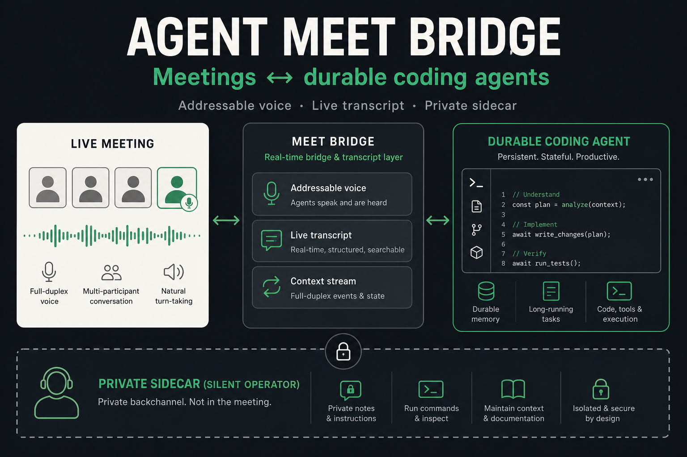
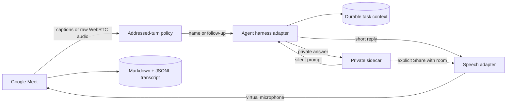

# Agent Meet Bridge



[](https://github.com/Bbasche/agent-meet-bridge/actions/workflows/ci.yml)
[](LICENSE)
[](package.json)
[](#requirements)

Bring a named, addressable coding agent into Google Meet. The agent joins as a participant, follows an agenda, answers when called by name, keeps a durable coding-task context, saves the call transcript, and gives the operator a private silent backchannel.

Agent Meet Bridge started with the Codex stack. Its meeting, transcript, harness, speech, and sidecar boundaries are now independently selectable: Codex, Claude Code, Hermes, Pi, and a shell-free generic CLI adapter implement the same durable harness contract, while local speech, OpenAI Realtime, Grok Voice, and experimental Codex Realtime share one meeting bridge.

> **Early release:** this is a working macOS prototype, not a hosted meeting-bot service. Google Meet DOM changes can break automation. Use it with informed participant consent and supervise it during calls.

## What works today

| Capability | Current implementation |
| --- | --- |
| Meeting presence | Dedicated Playwright-controlled Chrome profile; headed or headless |
| Addressability | Passive wake-name policy with a short follow-up window |
| Input transcript | Meet live captions or realtime-provider transcription, mirrored into the sidecar and Markdown/JSONL |
| Agent harness | Durable Codex, Claude Code, Hermes, or Pi sessions |
| Spoken replies | Local macOS speech, OpenAI Realtime, Grok Voice, or experimental Codex Realtime |
| Private backchannel | Token-authenticated `127.0.0.1` sidebar; private by default |
| Call record | Timestamped room transcript plus a separate private audit trail |
| Camera safety | Physical camera acquisition is blocked; the Meet camera control is verified off |
| Code access | Read-only by default; writes require launch-time permission and a private `Prototype` turn |

The Mac running the bridge must remain awake and online.

## How it works



The public/private boundary is enforced in the client, not only in the prompt. Private answers never reach meeting audio unless the operator explicitly opens **Share with room** and confirms **Speak in meeting**.

## Requirements

- macOS 14 or later
- Node.js 22 or later
- Google Chrome
- Xcode Command Line Tools (`swiftc`) for local speech output
- At least one supported harness: Codex CLI, Claude Code, Hermes, Pi, or an explicitly configured generic CLI
- A dedicated Google account for the meeting participant is strongly recommended

Apple Silicon is recommended. Linux and Windows speech adapters are roadmap items.

## Quick start

```bash
git clone https://github.com/Bbasche/agent-meet-bridge.git
cd agent-meet-bridge
npm ci
npm run setup:local
```

Sign the participant into an isolated Chrome profile once:

```bash
npm run assistant -- login --email bot@example.com
```

Complete Google sign-in in the opened browser. Do not point the bridge at your everyday Chrome profile.

Verify the machine before a call:

```bash
npm run doctor
```

Join a meeting:

```bash
npm run assistant -- start --headless \
  --meeting "https://meet.google.com/abc-defg-hij" \
  --name "YourAgent" \
  --instructions "You are our technical chief of staff." \
  --mode passive \
  --harness codex \
  --agenda ./agenda.example.md \
  --workspace /path/to/repository
```

The host may need to admit the participant. The bridge announces that it is an AI participant and is saving a transcript. The private sidebar opens locally after admission. Press `Ctrl+C` to leave cleanly.

After observing at least one other participant, the agent leaves automatically if it remains alone for five continuous minutes. It then asks the durable task for a private debrief and saves `debrief.md` beside the transcript. Set `--alone-timeout-minutes 0` to disable this behavior.

Omit `--headless` while debugging Meet automation. Headless mode is recommended for longer calls because it avoids rendering an unnecessary meeting window.

## Durable agent tasks

The bridge is BYO-agent: `--name` sets the wake name and participant identity, while `--instructions` supplies optional persona and role guidance. Choose `--harness codex`, `claude`, `hermes`, `pi`, or `generic`. Pass `--harness-context` to resume an existing task/session, or omit it to create a dedicated context. The same context owns voice-triggered and private-sidecar turns and remains available after the meeting.

To keep the same agent across rejoins, set the task once in the ignored `.env` file:

```dotenv
MEETING_AGENT_HARNESS=codex
MEETING_AGENT_HARNESS_CONTEXT_ID=your-task-or-session-id
```

For backwards compatibility, `--codex-thread` and `MEETING_AGENT_CODEX_THREAD_ID` still select a Codex task. The bridge intentionally ignores the ambient `CODEX_THREAD_ID`, because that task is normally already held by the process that launched the bridge.

Check a connector without joining a meeting:

```bash
npm run assistant -- harness-check --harness hermes --workspace /path/to/repository
```

Codex and Hermes have been exercised end to end by the project readiness command. Claude Code and Pi use their supported JSON/session interfaces; availability still depends on the local organization, subscription, or API credentials.

The generic adapter is intentionally low-level. It never invokes a shell, but the operator-supplied executable owns its own sandbox, credentials, and permission enforcement. Treat it as trusted local code.

## Private sidebar

The local sidebar combines two streams chronologically:

- **Call** — what Meet captions heard, including the agent's spoken replies.
- **Private** — the operator's silent prompts and the agent's private answers.

`⌘+Enter` sends privately. Private answers can be copied, used to prepare the operator's response, or deliberately shared with the room after an editable confirmation step. The server binds only to `127.0.0.1` and requires a random per-call token.

Preview the UI without joining a call:

```bash
npm run sidecar
```

## Configuration

Copy `.env.example` to `.env`. CLI flags take precedence.

| Variable | Purpose | Default |
| --- | --- | --- |
| `MEETING_AGENT_NAME` | Addressable participant name | `Agent` |
| `MEETING_AGENT_INSTRUCTIONS` | Optional persona or role guidance | none |
| `MEETING_AGENT_MODE` | `passive`, `active`, or `unrestricted` | `passive` |
| `MEETING_AGENT_HARNESS` | `codex`, `claude`, `hermes`, `pi`, or `generic` | `codex` |
| `MEETING_AGENT_HARNESS_CONTEXT_ID` | Resume a durable harness context | create a context |
| `MEETING_AGENT_WORKSPACE` | Repository the harness may inspect | current directory |
| `MEETING_AGENT_RUNTIME` | `local`, `codex`, `openai`, or `grok` | `local` |
| `MEETING_AGENT_TRANSCRIPT_SOURCE` | Input transcript adapter | `meet-captions` |
| `MEETING_AGENT_ALONE_TIMEOUT_MINUTES` | Alone time before automatic leave + debrief; `0` disables | `5` |
| `MEETING_AGENT_CODEX_THREAD_ID` | Legacy Codex-specific context variable | create a task |
| `MEETING_AGENT_AGENDA` | Agenda Markdown file | none |
| `MEETING_AGENT_PROFILE_DIR` | Dedicated Chrome profile | `data/browser-profile` |
| `MEETING_AGENT_VOICE` | Provider-specific voice or local locale | provider default |

Run `npm run assistant -- --help` for all flags.

## Transcript sources

The default local runtime treats Google Meet captions as the authoritative transcript. That path keeps Meet's participant labels, works in headless Chrome, and avoids a model API key. The tradeoffs are explicit:

- Meet controls recognition quality and caption availability.
- Caption DOM and accessible labels are private implementation details and may change.
- Captions must remain enabled in the participant session.

OpenAI Realtime and Grok Voice do not depend on captions for hearing. The bridge intercepts remote WebRTC audio tracks before Meet application code, mixes them in an `AudioWorklet`, emits exact 100 ms 48 kHz PCM frames, and downsamples when a provider requires 24 kHz. Provider transcription is stored in the same timeline. This removes caption latency and DOM dependence, but mixed audio is currently labeled `Meeting`; speaker diarization remains the next transcript milestone.

The return path is always real audio: the selected voice provider emits PCM and the bridge injects it into a synthetic Meet microphone.

## Audio roadmap

The raw-audio path now exists. The next audio milestones are:

1. Preserve per-track identity and add speaker diarization.
2. Add an `AudioWorklet`-backed local streaming transcription engine as a caption-free offline option.
3. Move the browser tap to a native WebRTC sink where hosted Chromium permits it.
4. Support cross-platform TTS and virtual audio devices.
5. Graduate to a hosted Chromium worker for agents that should join without an awake Mac.

Optional Whisper development assets can be installed with:

```bash
brew install whisper-cpp ffmpeg
npm run setup:local -- --with-whisper
```

OpenAI Realtime uses `OPENAI_API_KEY`; Grok Voice uses `XAI_API_KEY`. Both use the same provider-neutral runtime for PCM input/output, server VAD, passive wake-name gating, interruption, transcripts, harness tool calls, bounded reconnect buffering, and provider-specific session configuration.

Test either provider without joining a call:

```bash
npm run assistant -- realtime-check --runtime openai
npm run assistant -- realtime-check --runtime grok
```

The experimental Codex task-scoped runtime is retained behind `--runtime codex`. The installed CLI must expose and enable `realtime_conversation`; current Codex builds may additionally require API-key authentication even when ordinary coding tasks work through a ChatGPT subscription. The readiness command reports that distinction directly.

## Extending harnesses

Every harness implements the same behavioral contract:

```text
start or resume durable context
ask(question, transcript, agenda, visibility, permissions)
interrupt()
close()
```

Codex uses app-server JSON-RPC. Claude Code uses its noninteractive JSON and durable session flags. Hermes uses one-shot bot sessions and follows the new session ID produced by each resumed turn. Pi uses JSON event mode, durable sessions, and an explicit read-only tool allowlist. The generic adapter executes an explicit binary without a shell and supports `{prompt}`, `{context}`, and `{workspace}` argument templates, so Cursor, Agents SDK wrappers, and local MCP workers can connect without changing meeting code. Cursor remains generic because its current print-mode CLI exposes all tools and does not offer a read-only allowlist. See [ARCHITECTURE.md](ARCHITECTURE.md) for boundaries and invariants.

## Safety and privacy

- Obtain any consent required by participants and applicable law before recording or transcribing.
- Use a dedicated Google account and Chrome profile.
- Cookies, transcripts, audio, model weights, compiled helpers, and `.env` stay under ignored local paths.
- Harness turns are read-only by default. Each local harness still inherits whatever files and credentials its own CLI can read; use an isolated workspace and review that CLI's configuration. Hermes read-only turns use safe mode because its one-shot mode bypasses tool approvals.
- Spoken requests cannot authorize workspace writes.
- `--allow-writes` applies only to an explicitly private `Prototype` request.
- Treat captions and meeting speech as untrusted input; never place secrets in the agenda or transcript.

The audible disclosure is a product safeguard, not legal advice.

## Development

```bash
npm ci
npm run check
npm run check:audio
```

See [CONTRIBUTING.md](CONTRIBUTING.md) and [SECURITY.md](SECURITY.md). Issues and adapter proposals are welcome.

## License

MIT © Agent Meet Bridge contributors.
